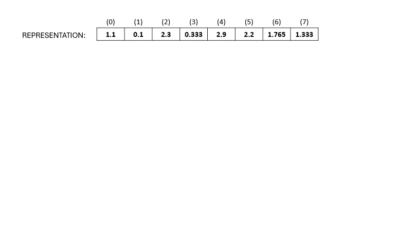
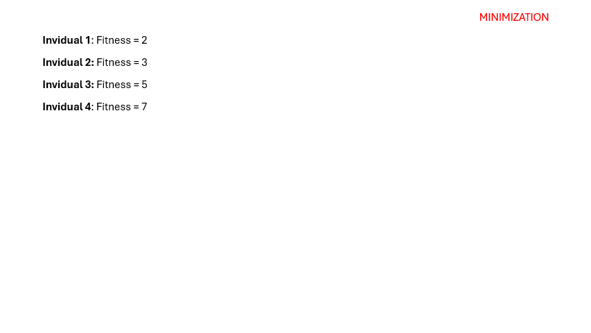
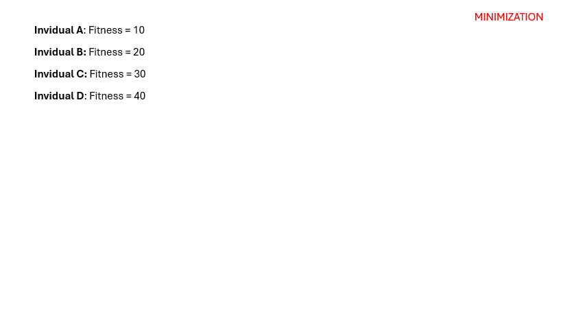
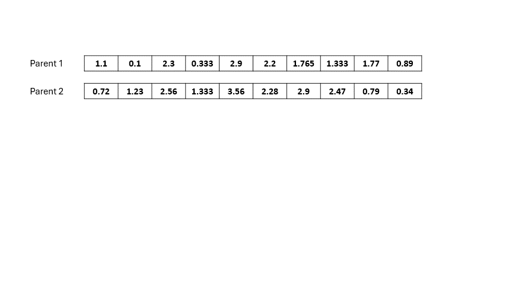
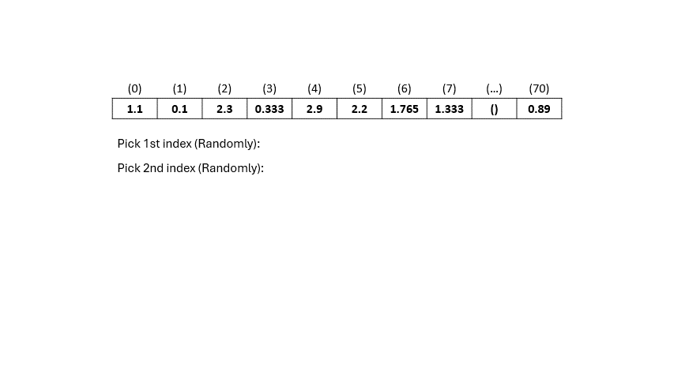

# CIFO_PROJECT

In this project, we are solving an Asymmetric Capacitated Vehicle Routing Problem (ACVRP) using genetic algorithms. We have implemented several variations of solutions by modifying the selection process, mutation, and crossover techniques.

***

## Index

1. [Problem Description](#problem-description)
2. [Genetic Algorithms](#genetic-algorithms)
3. [Representation](#representation)
4. [Fitness](#fitness)
5. [Genetic Algorithm Schema for Each Solution](#genetic-algorithm-schema-for-each-solution)
    - [Solution 1](#solution-1)
    - [Solution 2](#solution-2)
    - [Solution 3](#solution-3)
    - [Solution 4](#solution-4)
6. [Selection Operators](#selection-operators)
    - [fps (Fitness Proportionate)](#fps-fitness-proportionate)
    - [ts (Tournament Selection)](#ts-tournament-selection)
7. [Crossover Operators](#crossover-operators)
    - [single_point_xo (Single Point Crossover)](#single_point_xo-single-point-crossover)
    - [multi_point_xo (Multi Point Crossover)](#multi_point_xo-multi-point-crossover)
    - [uniform_xo (Uniform Crossover)](#uniform_xo-uniform-crossover)
8. [Mutation Operators](#mutation-operators)
     - [swap_mutator](#swap_mutator)
    - [scramble_mutator](#scramble_mutator)
    - [random_reset_mutator](#random_reset_mutator)

***

## Problem Description
The Asymmetric Capacitated Vehicle Routing Problem (ACVRP) involves optimizing the routing of vehicles to deliver goods from a depot to various customers while minimizing costs or maximizing efficiency. Key constraints include vehicle capacity limits and asymmetrical travel costs between locations.

***

## Genetic Algorithms
Genetic algorithms are a type of optimization algorithm inspired by the process of natural selection and genetics. They use a population of candidate solutions (individuals) that evolve over generations through selection, crossover (recombination), and mutation.

***

## Representation
In our problem, we are dealing with three trucks and 71 nodes to visit. Our representation involves a 70-element array (as the depot node does not need to be included in the solution representation), where each element is assigned a value between 0 and 2.99. The values between 0 and 1 correspond to truck 1, values between 1 and 2 correspond to truck 2, and values between 2 and 3 correspond to truck 3.

To determine the sequence of nodes for each truck's path, we sort the nodes in ascending order based on their assigned values in the array. This sorting process allows us to understand the sequence of nodes that each truck will visit.

To enhance clarity regarding this approach, please refer to the accompanying GIF demonstration (using an example with 9 nodes where the 9th node is the depot node). 

The representation concept used in this project was inspired by the research presented in the article titled "A Genetic Algorithm for the Asymmetric Capacitated Vehicle Routing Problem" (available at this link).

***

## Fitness

The fitness of our solution is determined by the total distance traveled by the three trucks from the moment they depart the depot until they complete their routes. It's crucial to mention that if any truck exceeds its capacity limit, we apply a penalty to the solution. This penalty involves multiplying the fitness value by 10,000.

In summary, our fitness metric evaluates the combined travel distance of all trucks, with a penalty imposed if any truck exceeds its capacity threshold. This approach ensures that our solution adheres to both distance efficiency and capacity constraints.

***

## Genetic Algorithm Schema for Each Solution

### **Solution 1** 
(pop_size=10, gens=1000, xo_prob=0.9, mut_prob=0.15, select=fps,xo=single_point_xo, mutate=variable_inversion_operator, elitism=True)

- **Selection Method:** [fps](#fps-fitness-proportionate)
  
- **Crossover Method:** [single_point_xo](#single_point_xo-single-point-crossover)
  
- **Mutation Method:** [swap_mutator](#swap_mutator)

### Solution 2
(pop_size=10, gens=100, xo_prob=0.9, mut_prob=0.15, select=ts, xo=single_point_xo, mutate=scramble_mutator, n=30)

- **Selection Method:** [ts](#ts-tournament-selection)
  
- **Crossover Method:** [single_point_xo](#single_point_xo-single-point-crossover)
  
- **Mutation Method:** [scramble_mutator](#scramble_mutator)

### Solution 3
(pop_size=10, gens=100, xo_prob=0.9, mut_prob=0.15, select=fps, xo=single_point_xo, mutate=random_reset_mutator, n=30)

- **Selection Method:** [fps](#fps-fitness-proportionate)
  
- **Crossover Method:** [single_point_xo](#single_point_xo-single-point-crossover)
  
- **Mutation Method:** [random_reset_mutator](#random_reset_mutator)

### Solution 4
- **TO DO**

***

## Selection Operators

### fps (Fitness Proportionate)
Fitness proportionate selection for minimization involves selecting individuals based on the inverse of their fitness values, giving higher probability to those with lower fitness. The total inverse fitness is calculated, a random number is generated within this range, and individuals are iterated through until their cumulative inverse fitness exceeds this random number, selecting that individual.

The following gif explains this process:

### ts (Tournament Selection)
In a tournament selection process, a specified number of individuals are randomly chosen from the population to compete. The fitness values of these participants are compared based on the optimization criterion (e.g., maximizing or minimizing fitness). The individual with the best fitness value according to this criterion is selected as the winner. This method helps in selecting strong individuals while maintaining diversity within the population.

The following gif explains this process:

***

## Crossover Operators

### single_point_xo (Single Point Crossover)
Single point crossover is a genetic algorithm technique where two parent solutions exchange segments at a randomly chosen point to create two new offspring, promoting genetic diversity. This method helps explore new solutions by combining different parts of the parents' genetic information.

The following gif demonstrates a cycle of single point crossover:

### multi_point_xo (Multi Point Crossover)
Similar to the [single_point_xo](#single_point_xo-single-point-crossover) shown above, but instead of a single crossover point, we have "n" crossover points, where "n" is a user-defined parameter.

### multi_point_xo (Multi Point Crossover)

### uniform_xo (Uniform Crossover)
Uniform crossover in genetic algorithms selects genes randomly from either parent with equal probability (50% chance for each parent). This process helps maintain genetic diversity by introducing randomness into the offspring. It's akin to flipping a coin for each gene to determine its source parent, facilitating exploration of different potential solutions.

The following gif demonstrates a cycle of uniform crossover:

***

## Mutation Operators

### swap_mutator
This function randomly selects pairs of indices within the chromosome and swaps the elements at those indices. The number of swaps performed is determined by the "n_loops". parameter.

###  scramble_mutator
TODO

### random_reset_mutator
TODO

